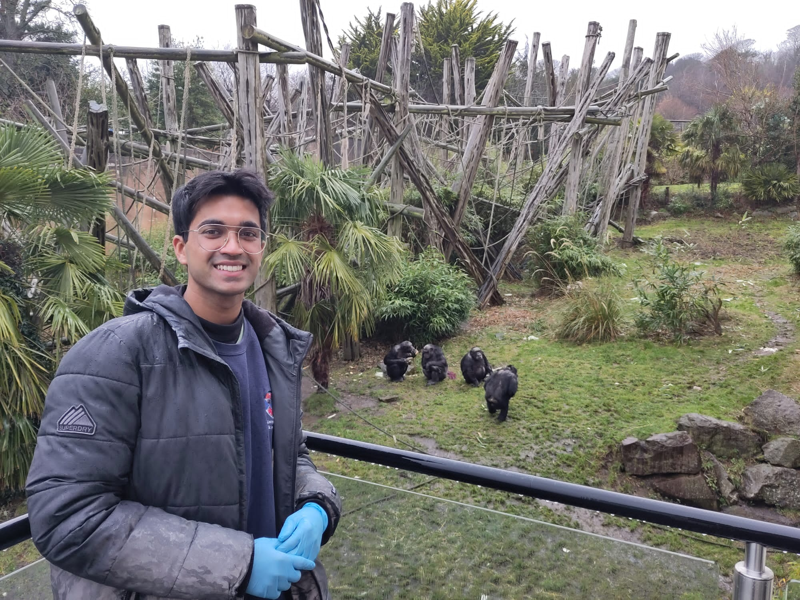

I am a linguist and psychologist specialising in the evolution of language and its links to social cognition. I have experience working with both humans and non-human primates and am currently pursuing a PhD at the University of Neuchâtel, where I am investigating the role of language in human hyper-cooperation using game theory models. The Hyper Cooperation Task is part of [NCCR Evolving Language](https://evolvinglanguage.ch), a research consortorium in Switzerland that aims to bring together an interdisciplinary team of scientists with the goal of uncovering the origins of language.

My research spans across multiple domains, including cognitive science, anthropology, philosophy, and linguistics. Over the course of my academic career, I hope to break new ground in our understanding of the biological, social, and cultural influences on the emergence of human intelligence.

 

I completed my MSc in Evolution of Language and Cognition at the University of Edinburgh. For my dissertation, I studied the influence of various behavioural and social contexts on the vocalisations of chimpanzees at the [Budongo Research Unit](https://living-links.org/about/living-links-budongo-consortium/), Edinburgh Zoo. My BA in Psychology from FLAME University laid the groundwork for my interdisciplinary approach, combining interests in cognitive science and cultural studies with research on human behavior.

When I'm not working, I enjoy hiking, cooking, and playing my guitar. I speak four languages and a fun fact about me is that I am really good at the Stroop test.

Reach out to me on [tanishq.chakravorty@unine.ch](mailto:tanishq.chakravorty@unine.ch).
